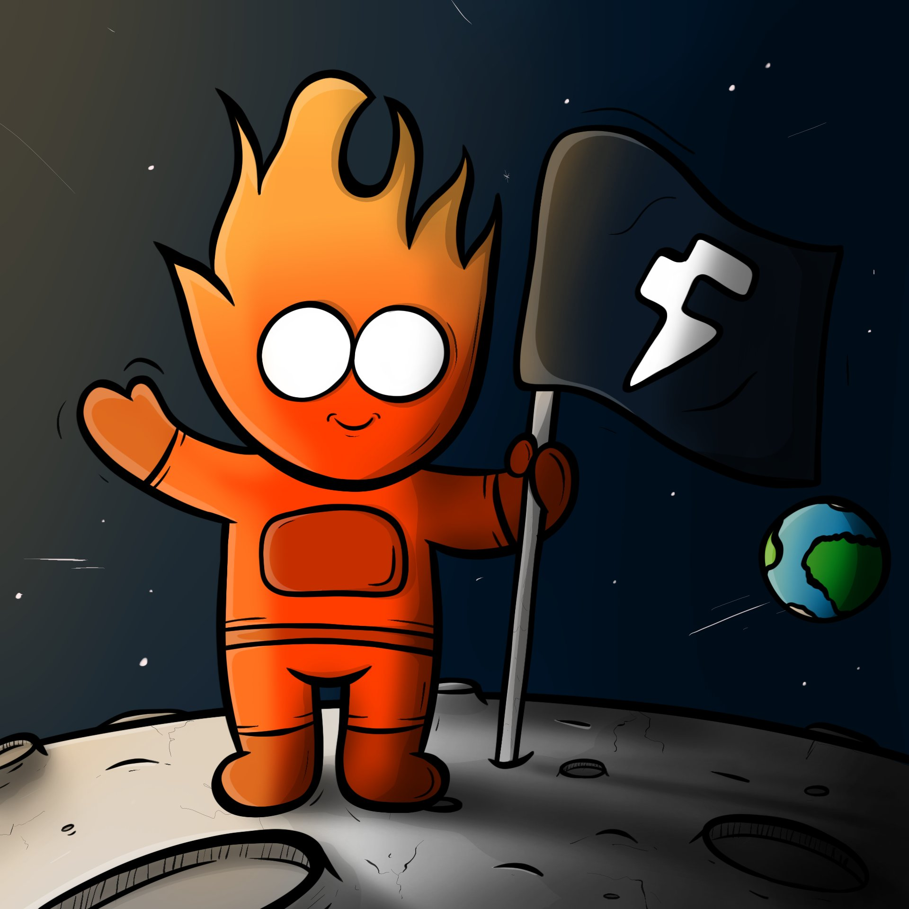

   # Fogo Companion Bot Using Sentientfoundation/models/dobby-unhinged-llama-3-3-70b-new

   

   Fogo Companion is an open-source, Telegram-style chatbot designed to educate users about the Fogo Chain ecosystem, a high-performance blockchain optimized for DeFi trading. Powered by Sentient Dobby AI's language model, the bot answers questions about Fogo Chain, Ambient Finance, Maximal Extractable Value (MEV), oracles, and more, using a curated knowledge base of Markdown documents. It features a sleek web interface, real-time chat, and Twitter integration for sharing responses, making it ideal for retail traders, developers, and DeFi enthusiasts exploring Fogo Chain's testnet.

   ## Features

   - **Interactive Chat Interface**: A Telegram-inspired UI with a responsive design, orange-themed styling, and animated message bubbles.
   - **Educational Knowledge Base**: Answers queries using ingested Markdown documents covering Fogo Chain, Ambient Finance, sandwich attacks, oracle manipulation, and testnet guides.
   - **Fireworks AI Integration**: Uses Fireworks AI's language model (`Sentient dobby-unhinged-llama-3-3-70b`) for natural, context-aware responses.
   - **Twitter Sharing**: Allows users to tweet bot responses directly from the interface.
   - **Document Ingestion Pipeline**: Automatically processes and updates Markdown, PDF, DOCX, and TXT files in the `docs/` directory.
   - **Supabase Integration**: Uses a PostgreSQL database (via Supabase) to store document metadata and vectorized content.

   ## Purpose

   Fogo Companion aims to make DeFi accessible by explaining complex concepts like MEV, sandwich attacks, and oracle manipulation in a beginner-friendly way. It draws inspiration from Fogees Hub's educational mission and supports users exploring Fogo Chain's testnet, including how to claim faucet tokens, trade on Ambient Finance, and use dApps like Valiant and FluxBeam.

   ## Prerequisites

   To run or contribute to Fogo Companion, ensure you have:
   - Python 3.9+
   - Node.js (for local development of the frontend)
   - A Fireworks AI API key (see [Getting a Fireworks AI API Key](#getting-a-fireworks-ai-api-key))
   - A Supabase account with a PostgreSQL database
   - A Vercel account for deployment
   - Git for cloning the repository

   ## Installation

   1. **Clone the Repository**:
      ```bash
      git clone https://github.com/your-username/fogo-companion.git
      cd fogo-companion
      ```

   2. **Install Python Dependencies**:
      ```bash
      pip install -r requirements.txt
      ```
      The `requirements.txt` includes:
      - `flask`: Web framework for the backend
      - `python-dotenv`: Environment variable management
      - `pypdf`, `python-docx`: Document parsing
      - `requests`, `werkzeug`: HTTP requests and utilities
      - `gunicorn`, `uvicorn`: WSGI servers
      - `sqlalchemy`, `psycopg2-binary`: Database integration

   3. **Set Up Environment Variables**:
      Create a `.env` file in the project root:
      ```bash
      touch .env
      ```
      Add the following:
      ```
      DATABASE_URL=postgresql://postgres.wdggmjptthigkrsosinw:[YOUR-PASSWORD-without special characters(!,@...)]@aws-1-eu-north-1.pooler.supabase.com:6543/postgres
      ADMIN_PASSWORD=your_secure_admin_password
      ```
      - Replace `[YOUR-PASSWORD]` with your Supabase database password.
      - Set `ADMIN_PASSWORD` for the admin interface (`/admin`).

   4. **Set Up the Docs Directory**:
      Create a `docs/` directory and add Markdown files (e.g., `pyth_evolution.md`, `sandwich_attack.md`) with educational content about Fogo Chain. Example files are included in the repository.

   5. **Initialize the Database**:
      Run the ingestion script to populate the Supabase database and vector store:
      ```bash
      python ingest.py
      ```

   6. **Run Locally**:
      Start the Flask app:
      ```bash
      python app.py
      ```
      Access the chatbot at `http://localhost:5000`.

   ## Getting a Fireworks AI API Key

   Fogo Companion uses Fireworks AI's `mixtral-8x7b-instruct` model for LLM responses (see `llm_runner.py`). To obtain an API key:
   1. Visit [https://fireworks.ai/](https://fireworks.ai/) and sign up for an account.
   2. Navigate to the **API Keys** section in your Fireworks AI dashboard.
   3. Generate a new API key (it starts with `fw_` followed by alphanumeric characters).
   4. On first use, the chatbot prompts you to enter this key via the web interface. It is stored locally in your browser for subsequent sessions.
   5. Alternatively, add the key to your `.env` file for testing:
      ```
      FIREWORKS_API_KEY=fw_xxxxxxxxxxxxxxxxxxxx
      ```
      **Note**: Keep your API key secure and never commit it to version control.

   ## Usage

   1. **Access the Chatbot**:
      - Open the web interface (e.g., `http://localhost:5000` locally or your Vercel URL).
      - If no API key is stored, enter a valid Fireworks AI API key when prompted.

   2. **Ask Questions**:
      - Type questions like:
        - "What is Fogo Chain?"
        - "How do sandwich attacks work?"
        - "Fogo Chain Testnet Guide"
      - Press the send button (paper plane icon) or hit Enter.

   3. **Share Responses**:
      - Click the "Tweet" button on bot responses to share them on Twitter.

   4. **Admin Interface**:
      - Access admin and log in with the `ADMIN_PASSWORD` to upload new documents or manage the knowledge base.
   
   5. **Dobby Usage**
 ```
import requests
import json

url = "https://api.fireworks.ai/inference/v1/chat/completions"
payload = {
  "model": "accounts/sentientfoundation/models/dobby-unhinged-llama-3-3-70b-new",
  "max_tokens": 4096,
  "top_p": 1,
  "top_k": 40,
  "presence_penalty": 0,
  "frequency_penalty": 0,
  "temperature": 0.6,
  "messages": []
}
headers = {
  "Accept": "application/json",
  "Content-Type": "application/json",
  "Authorization": "Bearer <API_KEY>"
}
requests.request("POST", url, headers=headers, data=json.dumps(payload))
```


